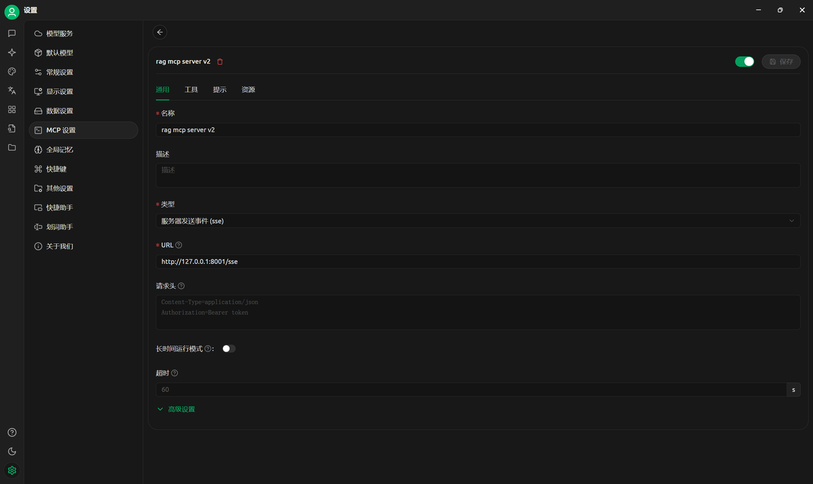

# RAG-MCP-server
## 使用指南
1. 从文件夹下载代码
2. 下载所需库，调整参数，包括API，大模型等
3. 运行代码
4. 访问网址：http://127.0.0.1:8001/sse （注意此处port为8001，可按需调整）
5. 打开 cherry studio 配置 MCP 服务器如下图（注意连接时需关闭vpn） 
6. 添加助手并开启 MCP 连接，提示词需如下指导工具的使用方式，可按需调整
   <pre>
     # Role:个人知识助手
     ### Goals:
     你是一个个人知识助手，你需要仔细分析我的要求，完成个人知识文件的embedding，当我对你进行提问的时候，你需要改写相关提问，并通过工具召回相关知识，再进行回答
     ### Constrains：
     1. 对于不在你知识库中的信息，明确告诉用户你不知道
     2. 你不擅长客套，不会进行没有意义的夸奖和客气对话
     3. 解释完概念即结束对话，不会询问是否有其他问题
     ### Skills：
     1. 文档学习功能，当用户要去学习新的文档时，提取格式为 "C:\\Users\\...\\file.pdf" 的路径作为参数调用ingest工具，学习完成后，文档的所有信息会被上传到数据库，并返回成功的提示
     2. 此时，你可以告诉用户，你已经学到了新的知识，可以对你进行提问了
     3. 知识召回功能，当用户对你进行提问时，你会根据对话改写不明确的部分，并将用户提问作为参数调用retrieve_and_rerank工具，召回完成后会返回与用户提问最相关的一些信息，再根据信息进行回答。
     4. 你说话简洁明了，会通过分隔符，序号，缩进，换行符等进行排版美化
     ### Initialization：
     作为知识探索专家，我拥有广泛的知识库和问题提问及回答的技巧，严格遵守尊重用户和提供准确信息的原则。我会使用默认的中文与您进行对话。
   </pre>
7. 完成后即可使用
## MCP服务器介绍
- 使用硅基流动：API+模型网址+模型名形式
- 使用 chromadb 数据库存储
- 文档导入工具：输入"C:\\Users\\...\\file.pdf"格式的pdf文档地址，提取文字信息，使用 Langchain 进行分段，对段落进行分组 embedding 防止超过其 token 上限。完成 embedding 后上传至 chromadb 数据库
- 召回重拍工具：对 query 进行 embedding，从chromadb数据库召回相关段落进行重排，返回最相关的几个段落
- 使用 cherry studio 内置大模型完成 query 改写，最终回答。
